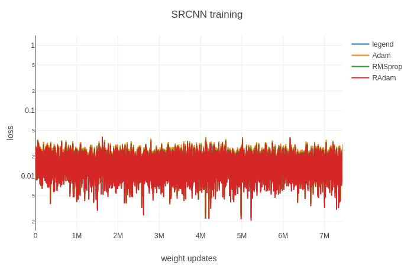
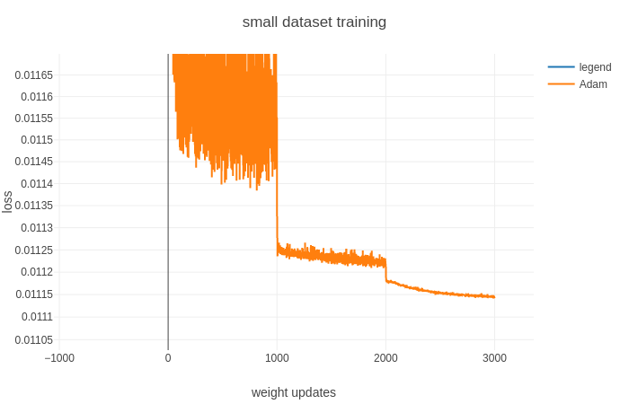

# A Game of Optimizers

zizizizi...... [HBO logo](fakeLink). When I write the title down, I know I would neta the well-known episode "A Game of Thrones"

> "neta" is the pronunciation of Japanese word "ネタ" which means joke material.

Image Source : [Deep Ideas](http://www.deepideas.net/deep-learning-from-scratch-iv-gradient-descent-and-backpropagation/)

This post should involve deep the history of training of algorithms, including GD, Adam and some novel optimizers as suggested by my supervisor. "Model is on one hand, and training on another", he insists.

## What is optimizer?

The name of learning algorithms revealed its most appealing property: use optimizer to learn the rules lies in data instead of waiting for crafted rules by human. Here I would like to refer to blogs of [Algorithmia](https://algorithmia.com/). 

>Optimizers tie together the loss function and model parameters by updating the model in response to the output of the loss function. 

## Stochastic gradient-based optimization

### SGD

## Adaptive stochastic optimization

### RMSprop

### Adam

## Warm-up and RAdam

People found warm up is kind of essential part of Adam, [On the Variance of the Adaptive Learning Rate and Beyond](https://arxiv.org/pdf/1908.03265.pdf) tried to find the position of warm-up and further proposed a new optimizer-RAdam, which is one of the main character in today's plot.

### What is warm-up

In a word, warm-up is using a small learning rate in the first few epochs of training.

## Deep Learning without Back-Propagation

Hilbert-Schmidt independence criterion bottleneck for training deep neural networks.

## Experiments

First of first, I choose SRCNN as our baseline experiment target. (DL model sounds like a laboratory mouse in the context LOL), _SDG_, _Adam_, _RAdam_ and _HSIC Bottleneck_

Radam is ready to use, so I experimented it for demonstration.

__

I found using a factor to accumulate the loss and average the loss when output would slow down the training (weird) so I allow the noise to be shown in my graph.... that looks bad.

I thought just give the network a small dataset and wait for their overfit should be time-saving.

