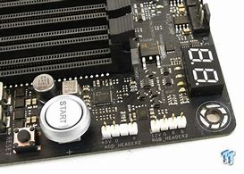
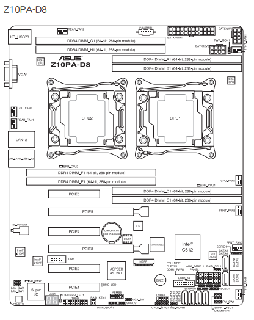
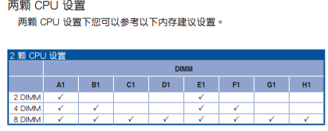
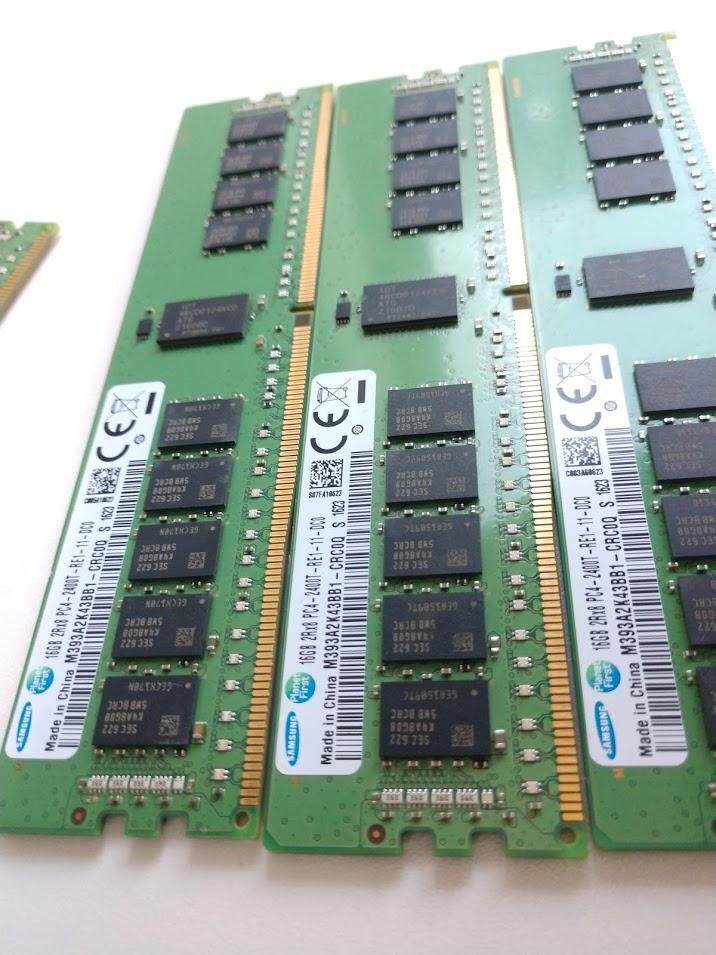

# B7 Code is showing up in my motherboard and lower right corner

我太难了，啊

Life sucks, right?

I was wandering what functionality could the micro display (known as Q-log) last week. The machine did not want to fail my curiosity and prepared me a huge surprise. It refuse to boot and showing "b7" error code.

What do "b7" code even mean? I researched all over  the Internet, few people talk about the error and I conclude that number is related to memory or Bios. Actually, there is a post suggesting unplugging all wires and just reboot....... that's ridiculous! But I tried, after all, hoping magic while observed nothing.

错误信息：电脑开机无法进入BIOS，准确地说是在系统自检（Power On Self Test）时卡在b7时无法继续加载。开机自检是主板的基本操作，意在检测硬件设置。就个人经验来说，增减内存会有BIOS报警，插拔显卡可以正常开机，连BIOS都无法加载说明是硬件故障，故不应采取清楚CMOS、主板reset等操作 (bios level)。

修好后我发现正常工作状态Ｑ－ＬＥＤ显示ＡＡ。

I recalled what happened before the disaster. Minutes before the error code, I inserted a 1080 ti to an empty `PCIEx16` slot, then boot failed. I also recalled a boot exception happened two days later, when I was constructing [lmdb for pytorch](<https://github.com/Zi-angZhang/pytorch-load-faster>), computer died when large batches were loaded. Boot was stuck then, fortunately, it survived after all.

I checked Stack Overflow and lots of product-related forums. After successfully solved the problem, I decided to record the right way to solve the hard ware bugs.

1. find the manual. Hardwares varies a lot even from same manufacturer. Mose manuals are available in the official website. Just search the product build code (型号, I am not sure how to deliver that meaning in English) in search engine also does.
2. The most annoying feature of my error is that, it switches its code in Q-LED frequently, e.g. b6-b7-b8-a9-b7, I am confused. According to the [manual](https://dlsvr04.asus.com/pub/ASUS/mb/Socket2011-R3/Z10PA-D8/Manual/C13692_Z10PA-D8_Series_V3_WEB.pdf), b7 refers to _memory check_, which is compatible to other user's [issue](<https://forums.evga.com/Error-code-b7-and-that39s-where-it-hangs-m1963303.aspx>). 
3. I removed memories from DIMM slots, which took me lots of time because of the block of cooling towers. Yes, I used towers because there are two CPUs on board. As suggested by the manual, I inserted minimum number of rams which is two and there recommended position is A and E.  
4. Still not booting, but I noticed a change: the Q-LED sequence stopped in the first b7, rather than b7 - a9 - b7. I think this means memory init error in the first round. I suspect that the memory was broken.
5. Nooooo! the memories cost a lot! I have 8 samsung 16G ram, that is toooooo expensive for me to withstand!!!
6. I tried to justify which memory died. I distinguish each ram with their serial number, then I found that 3 of 8 rams share one same serial number! Are they fake rams? If so, I would be free of responsibility for the break down! Here is the image I took.
7. After a detailed search, I found the number listed is not the "serial number" but 'product batch number' instead. The QR codes read difference.
8. I was extremely sad, hopelessly randomly inserted one ram to G slot, Wow, it booted up!
9. I think the only problem is the slot on board. After a few trail, I inserted all rams excepted E&F and make the machine ran! 'b7' issue still exists with anyone of the two slot inserted.
10. Try or die! I use tissue paper rubbed the rom port, inserted, boom, it worked.

Hard to believe without real experience, I fixed the killing problem with a tissue paper.

it works nicely till now. The problem ate half of my day.

life sucks