# DCGANs for image super-resolution, denoising and debluring 文章精读

本文为wei wang, Qiaojin Yan于2017年在Stanford的工作

## 1. 简介

### 1.1. 相关工作

#### 1.1.1 单帧图像超分辨

使用卷积神经网络完成超分辨任务 VDSR, SRCNN, DRCN

使用GAN的图像效果更好，但是PSNR可能低一些 SRGAN

#### 1.1.2 图像去噪

普遍的做法是叠加稀疏的去噪[自动编码机](http://blog.sina.com.cn/s/blog_b0086f8c0101fa6k.html) 实现去噪。

#### 1.1.3 图像反卷积

 经典的图像反卷积的做法是使用深度学习去估计模糊核参数。

[Blind image blur estimation via deep learning]()

[learning a convolutional neural network for non-uniform motion blur removal]()

另外的思路是使用深度卷积神经网络直接反卷积。但是从原理上分析，贾佳亚团队认为[CNN无法直接反卷积](http://www.cse.cuhk.edu.hk/leojia/papers/deconv_nips14.pdf)。他们从反卷积的non-local特性提出了一种新的模型。

尽管如此，CNN在文字去模糊的工作上表现得很好。

### 1.2. 本文的贡献

我们提出一种使用深度卷积对抗生成神经网络实现超分辨和去噪。

## 2. 方法

### 2.1. DCGAN

DCGAN的思路是训练能够映射_低分辨率，有噪声_图像到理想图像的生成器G和区分真实图像和合成图像的判别器D。

[这篇知乎](https://zhuanlan.zhihu.com/p/68950581)介绍了GAN的工作原理是极大极小博弈，是最终的期望最小。GAN原文介绍了最优点存在于![[公式]](https://www.zhihu.com/equation?tex=p_%7Bg%7D+%3D+p_%7B%5Cbold%7Bdata%7D%7D)的情况下。

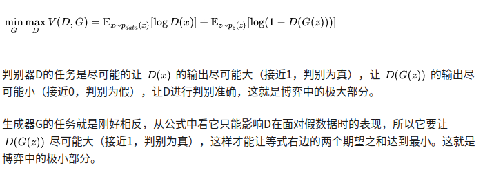

#### 2.1.1 生成器和判别器

生成器：残差网络

判别器：深卷积

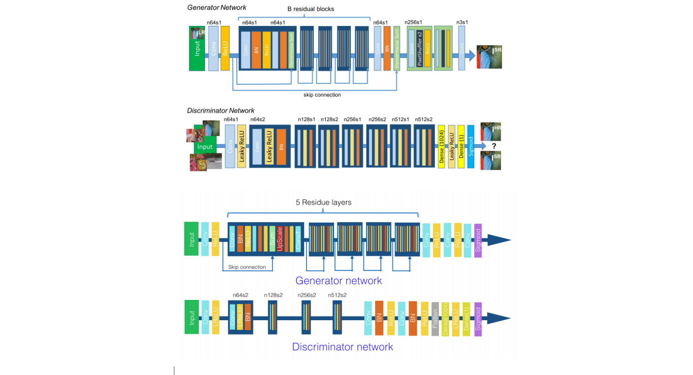

图一：上为SRGAN， 下为DCGAN

作者坦言两者是类似的，不过通过改变输入参数，DCGAN可以实现多任务。举例而言，超分辨任务中，我们输入下采样图像并输出上采样图像与真实图像对比。在去噪任务中，我们输入噪声图像。相对的，在去模糊任务中， 我们输入使用高斯核模糊的图像。

#### 2.1.2 损失函数

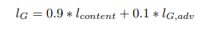

其中，内容损失（我也很想打公式，奈何github不支持mathjax）是l1损失，对抗损失由

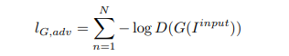

给出。

__原文这里没有提到N的意义，应当是`batch_size`__

## 3. 实验

### 3.1. 数据集和评估方法

- CelebA 人脸数据集 202,599张脸 
- [MIT 地点数据集]()

### 3.2 代码和训练细节

使用[srez](https://github.com/david-gpu/srez)的tensorflow代码进行训练，硬件平台为AWS [GRIDK520](https://www.videocardbenchmark.net/gpu.php?gpu=GRID+K520) （8G， 1536 x2 CUDA CORE）。每个任务大概训练三个小时。

### 3.3 试验结果

#### 3.3.1 超分辨

文章比较了人脸和自然景观两个数据集的结果表现（2倍放大），对照为双三插值。

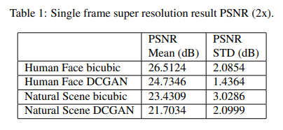

尽管使用DCGAN处理过的图像并不能实现比双三插值的峰值信噪比更高，但看起来更好。

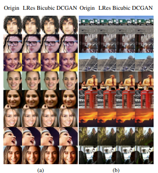

_有趣的是，作者分析了PSNR的标准差，并对更小的标准差作出解释_

DCGAN并不过分依赖图像的先验信息，因此无论图像包含怎样的特征， 总能相对稳定地输出超分辨结果。（此处没有比较常规的超分辨算法，例如SRCNN)

4倍超分辨的结果仍然锐利

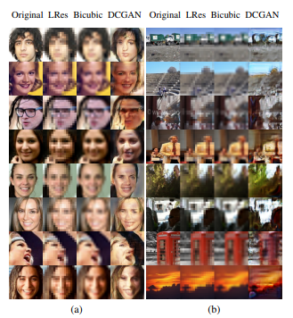

即使输入图像极端模糊，DCGAN仍然在结果中包含了清晰的五官。

作者发现DCGAN对自然景物的还原要好于对人脸的还原，作者的解释是人脑对人脸更敏感。

#### 3.3.2 去噪

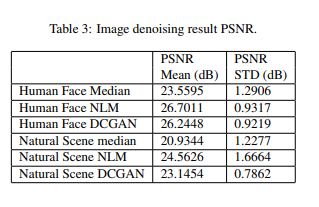

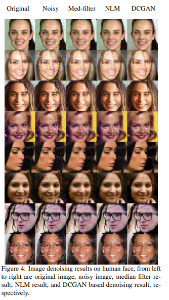

DCGAN确实有多一点点的细节

（Non-local means的结果真的好）

#### 3.3.3 去模糊

模糊图像的产生：`9x9`的高斯核外加标准差0.003的高斯噪声。和Wiener滤波以及[alternating direction method of multipliers](https://web.stanford.edu/~boyd/papers/pdf/admm_slides.pdf) (ADMM) 对比

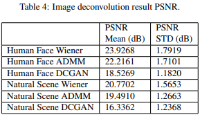

类似地，PSNR又输了。

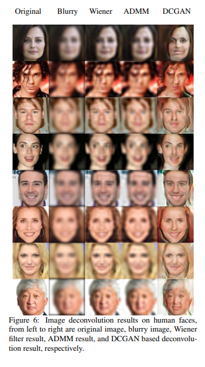

## 4. 讨论以及后续工作

DCGAN不是真正的Multi-tasking， 而是可以通过修改输入去被训练成不同的模型。对统一类别物体训练（分门别类训练）的效果可能会好（性别、年龄）

## 5. 结论

DCGAN 的结果看起来更漂亮。在人脸领域DCGAN的去模糊小伙比较好，但是并不适合更复杂的自然景物表现