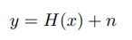
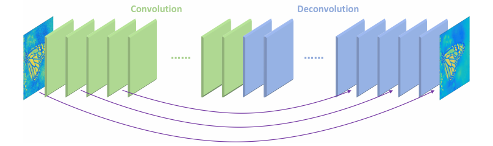
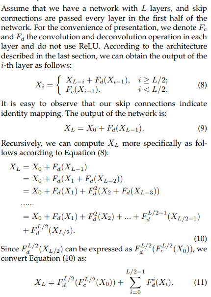
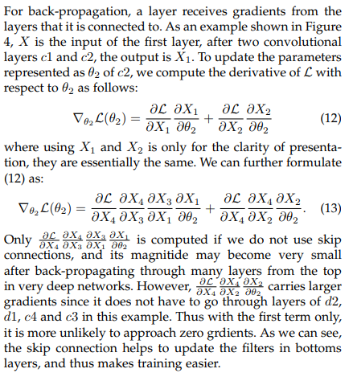

# Image Restoration Using Convolutional Auto-encoders with Symmetric Skip Connections

encoding-decoding framework with symmetric convolutional-deconvolutional layers.

[Article is available in arxiv](<https://arxiv.org/pdf/1606.08921.pdf>)

__Also, the author trained the framework to different models in different task, it is not a multi-tasking work.__

the corruption model suits to _super resolution, image denoising, inpainting, and recovering raw images from compressed images_

One of the early deep learning models which has been used for image denoising is the [Stacked Denoising Auto--endoders]()

## Contributions

1. Proposed a network consists of a chain of symmetric convolutional layers and deconvolutional layers, which is __Residual Encoder-Decoder__ Networks.
2. Added shortcuts which divided the network into several blocks. These skip connections halp to back-propagate the gradients to bottom layers and pass image details to the tip layers.
3. Applied the same network for tasks such as image denoising, image super-resolution and image inpainting.

[Image denoising: Can plain neural networks compete with BM3D?]()

[Deep network cascade]()

## Hight lights

the model is down without pooling and un-pooling. The reason is that for low-level image restoration, the aim is to eliminate low level corruption while preserving image details instead of learning image abstractions.

_skip connections_ passed feature maps to higher level deconvolutional layers, helping them to recover an improved clean version of the image.

As the model goes deeper, image restoration tasks tend to easily suffer from performance degradation. The reason may be two folds. 

1. With more layers of convolution, a significant amount of image details could be lost or corrupted. Given only image abstraction, recovering its details is  an under-determined problem.
2. Deep networks often suffers from gradients vanishing and become much harder to train.

__optimizing for the clean corruption converges better than optimizing for the clean image__

We trained the network with learning rate set to 0.0001.

Including equations in the paper

