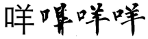
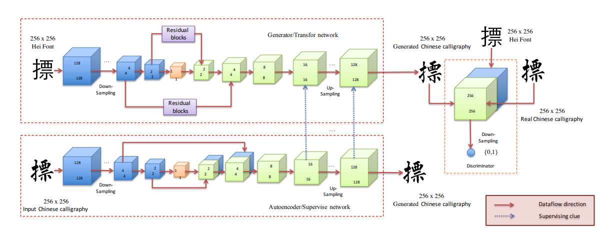

# Auto-Encoder Guided GAN for Chinese Calligraphy Synthesis.

Synthesizing Chinese calligraphy images with specified style from standard font (e.g. Hei font) images.

### problems:

1. Various Chinese calligraphy styles.
2. Deformations between the font image and calligraphy image.

### Recent approaches:

First, extract stokes from some known calligraphy characters and then some strokes are selected and assembled into a new calligraphy character. 

Over the past few years, many network architectures have been proposed and applied to different image-to-image tasks. However, those networks are all designed to handle pixel-to-pixel problems, such as semantic segmentation, and poor performance is achieved when there are deformations between the input and target images.

from left to right: the standard font image, the output of UNet, the output of our method and the target image.

### Contribution

a deep neural network based model which consists of two subnets:

- encoder-decoder network acting as image transfer
- autoencoder guide the transfer to lean the detailed stroke information from autoencoder's low features

