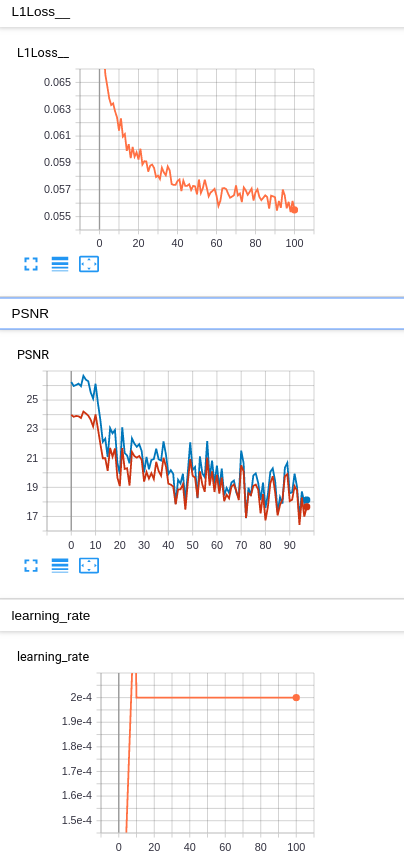
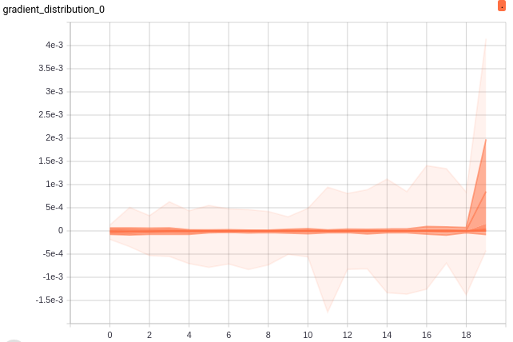
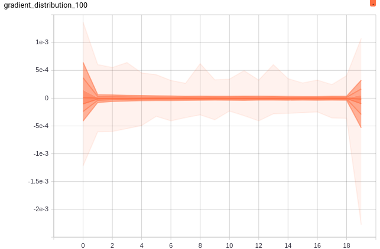

# Attention

Attention can be divided into two divisions:

1. channel attention
2. spatial attention

It should be noted that the attention mechanisms applied to SR in those works are borrowed from other vision problems such as classification, and thus they may not be optimal for SR.

__RAM: Residual Attention Module for Single Image Super-Resolution__

#### Existing modules:

- residual channel attention block
  $$
  \mathbf {M} = f_{ex} (\mathbf {S} _{avg}) = fc_2(ReLU(fc_1(\mathbf S _{avg}))\\
  \hat x = x \cdot \mathbf M
  $$
  使用全连接层实现数据的压缩（全连接层衔接通道少），更注重interchannel的联系

- convolution block attention module
  $$
  \mathbf M_1 = fc_2 (ReLU(fc_1(\mathbf S _{avg})))\\
   \mathbf M_1 = fc_2 (ReLU(fc_1(\mathbf S _{avg})))\\
   \hat x 
  $$
  
- channel-wise and spatial attention residual block

# Joint super resolution and denoise/deblur

- SR and denoising:
  - Learning a single convolutional super-resolution network for multiple degradations
- demoasicing and denoising
  - Joint demosaicking and denoising by total variation minimization
  - Joint demosaicing and denoising via learned nonparametric random fields.
  - Learning joint demosaicing and denoising based on sequential energy minimization
- SR and demosaicing
  - Multi-frame demosaicing and super resolution from undersampled color images
  - Joint demosaicing and super-resoluiton imaging from a set of unregistered aliased images
  - Deep residual network for joint demosaicicing and super resolution

Problems:

Training:

Testing:

Training details:

gradient distribution:

