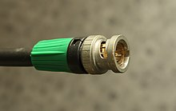
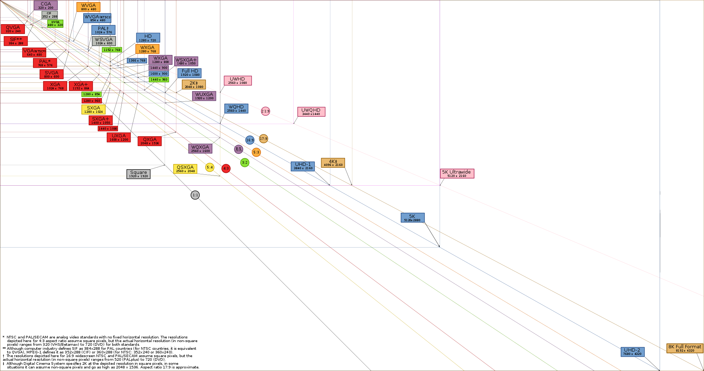

# image restoration with black magic devices

### reference:

<https://documents.blackmagicdesign.com/UserManuals/TeranexManual.pdf>

<https://en.wikipedia.org/wiki/Serial_digital_interface>

## abstarct

the __Teranex__ take __SDI__ as input.

> Serial digital interface is a family of digital video interfaces first standardized by _The society of Motion Picture and Television Engineers_ in 1989.
>
> The various serial digital interface standards all use (one or more) coaxial cables with BNC connectors, with a nominal impedance of 75 ohms. 
>
> |                        Standard                        |       Name       |                          Introduced                          |                      Bitrates                      | Example video formats |
> | :----------------------------------------------------: | :--------------: | :----------------------------------------------------------: | :------------------------------------------------: | :-------------------: |
> | [SMPTE 259M](https://en.wikipedia.org/wiki/SMPTE_259M) |      SD-SDI      | 1989[[2\]](https://en.wikipedia.org/wiki/Serial_digital_interface#cite_note-Hudson-2) | 270 Mbit/s, 360 Mbit/s, 143 Mbit/s, and 177 Mbit/s |      480i, 576i       |
> | [SMPTE 344M](https://en.wikipedia.org/wiki/SMPTE_344M) |      ED-SDI      | 2000[[8\]](https://en.wikipedia.org/wiki/Serial_digital_interface#cite_note-8) |                     540 Mbit/s                     |      480p, 576p       |
> | [SMPTE 292M](https://en.wikipedia.org/wiki/SMPTE_292M) |      HD-SDI      | 1998[[2\]](https://en.wikipedia.org/wiki/Serial_digital_interface#cite_note-Hudson-2) |        1.485 Gbit/s, and 1.485/1.001 Gbit/s        |      720p, 1080i      |
> | [SMPTE 372M](https://en.wikipedia.org/wiki/SMPTE_372M) | Dual Link HD-SDI | 2002[[2\]](https://en.wikipedia.org/wiki/Serial_digital_interface#cite_note-Hudson-2) |        2.970 Gbit/s, and 2.970/1.001 Gbit/s        |        1080p60        |
> | [SMPTE 424M](https://en.wikipedia.org/wiki/SMPTE_424M) |      3G-SDI      | 2006[[2\]](https://en.wikipedia.org/wiki/Serial_digital_interface#cite_note-Hudson-2) |        2.970 Gbit/s, and 2.970/1.001 Gbit/s        |        1080p60        |
> |                     SMPTE ST-2081                      |      6G-SDI      | 2015[[4\]](https://en.wikipedia.org/wiki/Serial_digital_interface#cite_note-SDI2081March2015IEEE-4) |                      6 Gbit/s                      |   1080p120, 2160p30   |
> |                     SMPTE ST-2082                      |     12G-SDI      | 2015[[5\]](https://en.wikipedia.org/wiki/Serial_digital_interface#cite_note-SDI2082March2015IEEE-5) |                     12 Gbit/s                      |        2160p60        |
> |                     SMPTE ST-2083                      |     24G-SDI      | In development [[9\]](https://en.wikipedia.org/wiki/Serial_digital_interface#cite_note-SMPTE:_32NF-70_WG-9)[[10\]](https://en.wikipedia.org/wiki/Serial_digital_interface#cite_note-10) |                     24 Gbit/s                      |   2160p120, 4320p30   |
>
> 

resolution

> .svg.png)
>
> 4K resolution refers to a horizontal display resolution of approximately 4,000 pixels.
>
> 
>
> 4K UHD $3840 \times 2160$
>
> DCI 4K $4096 \times 2160$
>
> 

solved: __frame interpolation__

__super resolution__ : upsampling

our machine supports 1920 $\times$ 1080, so our solution is input 720 $\times $ 576 videos